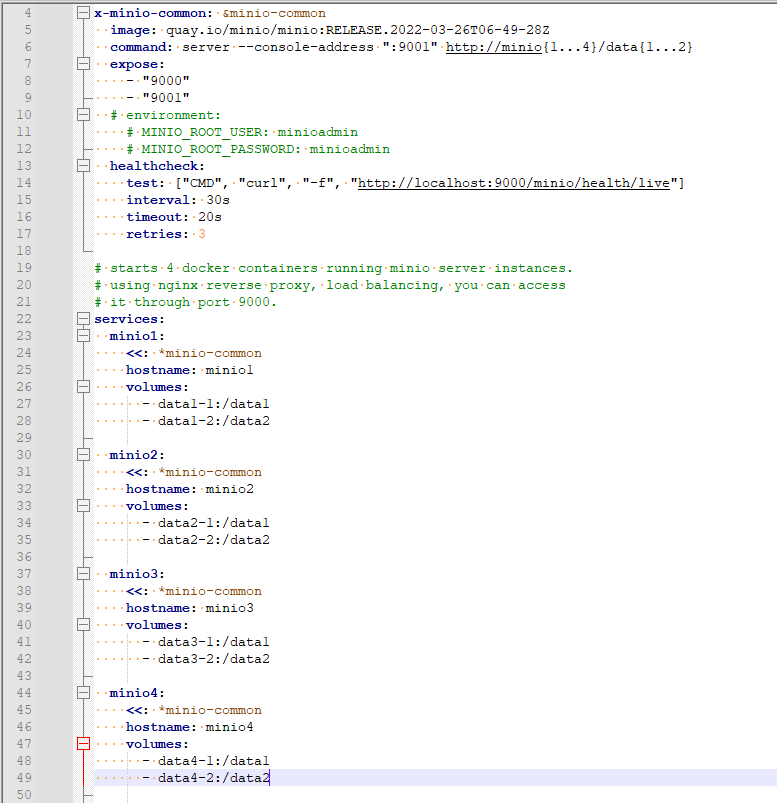

#### minio docker-compose yaml 文件源码鉴赏

* 框架

  框架简洁，包括yaml版本、服务、存储卷和4个minio容器的公用部分组成
  

* 锚点标签“&”和引用标签“*”

  x-minio-common--X个minio公用的部分，包括：image、command、expose、healthcheck

   

  锚点标签：“&minio-common”
  引用锚点：“*minio-common”
  引用并与其他数据合并：<<: *minio-common
  这样写的好处是不必每个服务里都这样写一遍重复的内容，相当于提取最大公约数
  参考：[一文看懂 YAML - 知乎 (zhihu.com)](https://zhuanlan.zhihu.com/p/145173920)

  

* command: server --console-address ":9001" http://minio{1...4}/data{1...2}
  相当于大括号的列举，每个minio有两个数据盘data1和data2，一共4个minio，合起来就是8个数据盘

* 源码

  ```
  version: '3.7'
  
  # Settings and configurations that are common for all containers
  x-minio-common: &minio-common
    image: quay.io/minio/minio:RELEASE.2022-03-26T06-49-28Z
    command: server --console-address ":9001" http://minio{1...4}/data{1...2}
    expose:
      - "9000"
      - "9001"
    # environment:
      # MINIO_ROOT_USER: minioadmin
      # MINIO_ROOT_PASSWORD: minioadmin
    healthcheck:
      test: ["CMD", "curl", "-f", "http://localhost:9000/minio/health/live"]
      interval: 30s
      timeout: 20s
      retries: 3
  
  # starts 4 docker containers running minio server instances.
  # using nginx reverse proxy, load balancing, you can access
  # it through port 9000.
  services:
    minio1:
      <<: *minio-common
      hostname: minio1
      volumes:
        - data1-1:/data1
        - data1-2:/data2
  
    minio2:
      <<: *minio-common
      hostname: minio2
      volumes:
        - data2-1:/data1
        - data2-2:/data2
  
    minio3:
      <<: *minio-common
      hostname: minio3
      volumes:
        - data3-1:/data1
        - data3-2:/data2
  
    minio4:
      <<: *minio-common
      hostname: minio4
      volumes:
        - data4-1:/data1
        - data4-2:/data2
  
    nginx:
      image: nginx:1.19.2-alpine
      hostname: nginx
      volumes:
        - ./nginx.conf:/etc/nginx/nginx.conf:ro
      ports:
        - "9000:9000"
        - "9001:9001"
      depends_on:
        - minio1
        - minio2
        - minio3
        - minio4
  
  ## By default this config uses default local driver,
  ## For custom volumes replace with volume driver configuration.
  volumes:
    data1-1:
    data1-2:
    data2-1:
    data2-2:
    data3-1:
    data3-2:
    data4-1:
    data4-2:
  
  ```

  